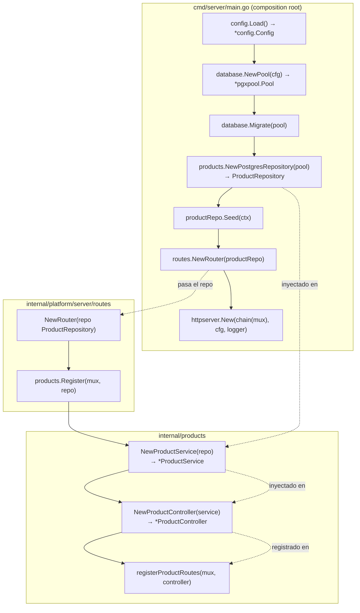
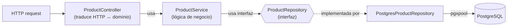

# Arquitectura

Este documento describe la organización del proyecto y, en particular, cómo se
hace la **inyección de dependencias** desde `cmd/server/main.go` hacia las capas
de cada feature (repository → service → controller → routes).

---

## Estructura de paquetes

```
cmd/server/                         # entrypoint (composition root)
internal/
  platform/                         # infraestructura transversal (no negocio)
    config/                         # carga de configuración (env)
    database/                       # conexión pgxpool + migraciones
      migrations/                   # *.up.sql / *.down.sql (embebidas)
    server/
      httpserver/                   # ciclo de vida del http.Server
      middleware/                   # request id, logging, recovery, cors, rate limit...
      respond/                      # helpers HTTP (JSON, errores)
      routes/                       # router raíz que ensambla features
  products/                         # feature autocontenida (capas claras)
    model.go                        # dominio + DTOs + responses
    product_repository.go           # interfaz ProductRepository
    product_repository_postgres.go  # implementación PostgreSQL (pgxpool)
    product_service.go              # lógica de negocio
    product_controller.go           # HTTP ↔ dominio
    product_routes.go               # Register + registro de rutas
    seed.go                         # catálogo inicial
```

Regla general: **`platform` no conoce a las features**; las features dependen de
`platform` (config, respond, ...), nunca al revés.

---

## Inyección de dependencias: construcción

`cmd/server/main.go` es el **composition root**: el único lugar donde se
construyen las dependencias concretas y se ensamblan. Ninguna otra capa
construye dependencias de otra capa.



### Orden de construcción (de la infraestructura hacia la feature)

`Config` → `Pool` → `Migrate` → `Repository` → `Seed` → `Router` → `Server`.

Primero se crea lo que no depende de nada, y cada paso recibe lo ya creado.

### Dirección de la inyección (constructor injection)

Cada constructor recibe por parámetro lo que necesita:

| Constructor | Recibe | Devuelve |
|---|---|---|
| `database.NewPool(cfg)` | `*config.Config` | `*pgxpool.Pool` |
| `products.NewPostgresRepository(pool)` | `*pgxpool.Pool` | `ProductRepository` |
| `products.NewProductService(repo)` | `ProductRepository` | `*ProductService` |
| `products.NewProductController(service)` | `*ProductService` | `*ProductController` |
| `routes.NewRouter(repo)` | `ProductRepository` | `*http.ServeMux` |

El cableado interno de la feature está encapsulado en `products.Register`:

```go
func Register(mux *http.ServeMux, repo ProductRepository) {
    service := NewProductService(repo)
    controller := NewProductController(service)
    registerProductRoutes(mux, controller)
}
```

---

## Dependencias en tiempo de ejecución

Cada capa solo conoce la **abstracción** de la de abajo. En concreto,
`ProductService` depende de la **interfaz** `ProductRepository`, no de la
implementación `PostgresProductRepository`.



Flujo de una request (sentido inverso al de construcción):

`Controller → Service → ProductRepository (interfaz) → PostgresProductRepository → pgxpool → PostgreSQL`

---

## Por qué se hace así

- **Composition root único**: toda la "magia" de ensamblaje vive en `main`. El
  resto del código no sabe cómo se crean sus dependencias, solo las usa.
- **Depender de interfaces, no de implementaciones**: permite cambiar el backend
  de persistencia o inyectar un doble en tests sin tocar service ni controller.
  Es la costura que usan los tests de integración (que inyectan el repo real y
  se saltan si no hay base de datos).
- **Sin estado global**: nada de singletons ni `init()` ocultos; las
  dependencias viajan explícitas por parámetros, lo que hace el flujo fácil de
  seguir y de testear.
- **`context.Context` extremo a extremo**: el contexto de la request
  (`r.Context()`) viaja Controller → Service → Repository, habilitando
  timeouts/cancelación contra la base de datos.
